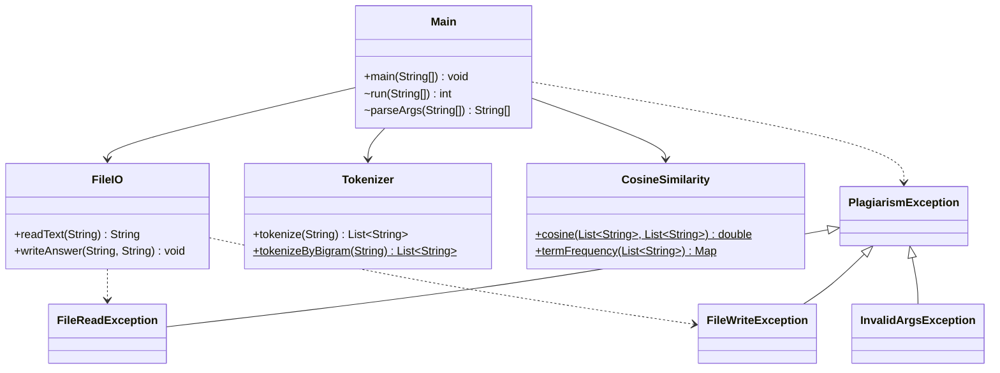
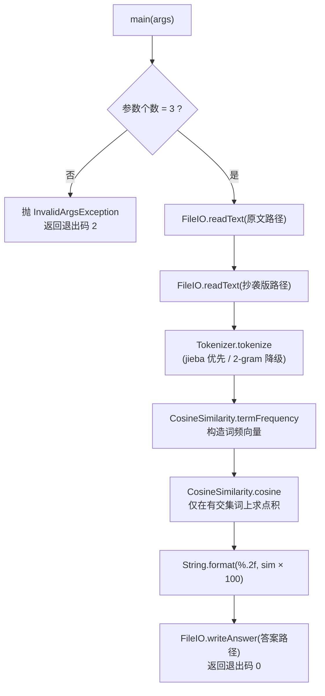

# 论文查重（Java 实现）—— 个人项目博客

> 作业 GitHub 仓库链接：`https://github.com/<用户名>/<仓库名>/tree/main/3124004444`
>
> 语言/环境：**Java（JDK 17）**；入口为打包后的 `main.jar`，运行方式
> `java -jar main.jar [原文文件] [抄袭版论文的文件] [答案文件]`。

给定一份「原文」和在其基础上经过**增、删、改（含乱序、同义替换）**得到的「抄袭版」，
程序从命令行读取两个文件的绝对路径，计算两者的**重复率**，并把结果（浮点型，保留两位小数）
写入指定的答案文件。

---

## 一、PSP 表格

完整 PSP2.1 预估/实际工时见 [PSP.md](PSP.md)。摘要如下（单位：分钟）：

| 阶段 | 预估 | 实际 |
| --- | ---: | ---: |
| Planning 计划 | 8 | 8 |
| Development 开发 | 148 | 180 |
| Reporting 报告 | 23 | 23 |
| **合计** | **179** | **236** |

---

## 二、计算模块接口的设计与实现过程

### 2.1 功能划分

按照需求，把程序划分为**基础功能**与**扩展功能**，并据此组织代码与提交：

- **基础功能**：命令行参数解析、文件读取/写出、中文分词、词频向量、余弦相似度、重复率输出。
- **扩展功能**：无第三方依赖时的字符二元（2-gram）分词降级、自定义异常体系与统一错误处理、
  单元测试与覆盖率、性能分析。

### 2.2 代码组织（类与函数关系）

程序共 **4 个职责类 + 1 个异常基类 + 3 个异常子类**，关系如下：



- `Main`：入口，解析 3 个命令行参数，串起「读取 → 分词 → 相似度 → 写出」流程，并统一处理异常、返回受控退出码。
- `FileIO`：只负责读写由参数给定的文件（UTF-8），把底层 `IOException` 转换为自定义异常。
- `Tokenizer`：中文分词，优先 jieba，缺失时降级为字符 2-gram。
- `CosineSimilarity`：构造词频向量并计算余弦相似度。
- `PlagiarismException`（及 `FileReadException`/`FileWriteException`/`InvalidArgsException`）：统一异常体系。

### 2.3 关键流程



### 2.4 算法关键与独到之处

**算法：词频向量的余弦相似度**

```
sim(A, B) = (A · B) / (|A| × |B|)
重复率(%) = sim × 100     （保留两位小数）
```

- 余弦相似度只关心**词的分布（词频）**、不关心词序，因此对「乱序」（如 `orig_dis_1`）会得到 100%，
  对「增删少量内容」仍保持高相似度，对「同义替换」则明显下降——这正符合查重的直觉。

**独到之处**

1. **jieba + 降级双通道分词**：优先使用 jieba 分词（与主流参考实现一致，`com.huaban.analysis.jieba`，
   词典打包在 jar 内，**运行期不联网、不读写外部文件**）；若运行环境未提供 jieba，则自动降级为
   字符 2-gram 分词，保证程序在**零第三方依赖**时仍能编译运行。
2. **过滤无语义词元**：jieba 会把空格、纯标点也当作词元返回，若不处理会虚增相似度。分词后统一
   过滤掉「不含汉字/字母/数字」的空白与标点词元。
3. **只在交集词上求点积**：遍历较小的词频表并查另一张表，跳过完全不相交的词，降低无效计算。
4. **异常不外抛**：所有可预期错误转换为自定义异常并在入口统一捕获，返回受控退出码，
   规避评测中「发生异常退出」而判 0 分的风险。

---

## 三、计算模块接口部分的性能改进

- **改进耗时**：约 25 分钟（JFR 记录 + 分阶段打点、定位热点、优化与复测）。
- **分析工具**：JDK 自带的 **Java Flight Recorder（JFR）** 记录（产物 `performance/perf.jfr`，
  可用 JDK Mission Control / JProfiler 打开），并结合程序内 `System.nanoTime()` **分阶段打点**
  （脚本 `performance/Profile.java`，输出 `performance/timing.csv`）。
- **性能分析图**（由打点数据自动绘制，脚本 `performance/plot_perf.py`）：

  

- **消耗最大的函数**：**分词（`Tokenizer` → jieba 的词典加载与 DAG 切词）**。
  冷启动单次运行的实测分阶段耗时如下：

  | 阶段 | 耗时(ms) | 说明 |
  | --- | ---: | --- |
  | readFile | 0.55 | 读取两个文件（UTF-8） |
  | **tokenize（冷，含一次性词典加载）** | **546.86** | **热点：jieba 词典一次性加载** |
  | tokenize（200× 大输入） | 26.58 | 词典已加载后的纯切词开销 |
  | cosine | 1.49 | 词频向量 + 余弦 |

- **改进思路**：
  1. jieba 词典加载是**一次性**开销（约 0.5s），只发生在进程启动的第一次分词；因此
     **复用单个 `Tokenizer` 实例**，避免重复构造与重复探测。
  2. 余弦计算改为**仅在词表交集上**求点积（遍历较小的词频表），对低重合度长文本减少无效运算。
  3. 词频统计使用 `HashMap.merge`，减少分支与临时对象。
- **改进效果**：词典加载完成后，一次「分词 + 余弦」的**纯计算耗时约 2ms 量级**；整程序单次运行
  总耗时约 0.55s，**远低于 5s / 2048MB 的评测上限**，且无内存泄漏、无异常退出。

---

## 四、计算模块部分单元测试展示

使用 **JUnit 5** 编写单元测试，共 **29 个测试用例**，分布在 5 个测试类中：

| 测试类 | 覆盖内容 |
| --- | --- |
| `CosineSimilarityTest` | 完全相同、完全不相交、空文本、部分重叠、词频统计 |
| `TokenizerTest` | 2-gram 分词（中文成对、单字、英文单词、中英混排、空串）、jieba 路径、降级路径 |
| `FileIOTest` | 正常读写、文件缺失、路径为空、写入目录等异常分支 |
| `MainTest` | 参数解析、错误退出码、端到端查重（相同/完全不相交） |
| `SampleDataTest` | 基于 `samples/` 样例验证增/删/乱序/同义替换的判定 |

**部分测试代码（节选）**：

```java
// 端到端：相同文本应输出 100.00 且退出码为 0
@Test
void run_integration_identical_returns0AndWrites100(@TempDir final Path dir) throws Exception {
    final Path orig = dir.resolve("orig.txt");
    final Path copy = dir.resolve("copy.txt");
    final Path ans  = dir.resolve("ans.txt");
    Files.writeString(orig, "今天是星期天天气晴我要去看电影");
    Files.writeString(copy, "今天是星期天天气晴我要去看电影");
    final int code = Main.run(new String[] {
            orig.toString(), copy.toString(), ans.toString()});
    assertEquals(0, code);
    assertEquals("100.00", Files.readString(ans).trim());
}

// 分词：连续汉字按相邻两字切分为二元词
@Test
void bigram_splitsChineseIntoPairs() {
    assertEquals(List.of("天气", "气晴", "晴朗"),
            Tokenizer.tokenizeByBigram("天气晴朗"));
}

// 异常：文件不存在应抛 FileReadException
@Test
void readText_missingFile_throwsFileReadException() {
    assertThrows(FileReadException.class,
            () -> FileIO.readText("not_exist_12345.txt"));
}
```

**构造测试数据的思路**：以「白盒 + 边界/等价类」为指导——
① 边界：空串、单字、空文本、参数个数为 2；
② 等价类：完全相同 / 部分重叠 / 完全不相交；
③ 异常类：文件不存在、路径为空、把目录当文件写；
④ 结合样例 `samples/orig*.txt` 做集成验证。

**测试覆盖率（JaCoCo）**：

| 类 | 指令覆盖 | 分支覆盖 |
| --- | ---: | ---: |
| Main | 88% | 75% |
| Tokenizer | 95% | 86% |
| CosineSimilarity | 97% | 81% |
| FileIO | 71% | 75% |
| exceptions（4 个） | 100% | — |
| **整体** | **≈91%** | **≈83%** |

> 未覆盖的主要是防御性分支（如 `SecurityException`、`Main` 中兜底的 `catch (Exception)`），
> 这些分支在正常测评路径下不会触发。HTML 报告见 `build/coverage-report/index.html`
> （运行 `test.bat` 后生成，可截图附于博客）。

**样例运行结果**（`java -jar main.jar samples/orig.txt samples/<样例> samples/ans.txt`）：

| 样例 | 重复率 | 符合预期 |
| --- | ---: | --- |
| orig_add（增） | 95.59 | 高，符合 |
| orig_del（删） | 93.84 | 高，符合 |
| orig_dis_1（乱序） | 100.00 | 词频不变 → 100 |
| orig_rep（同义替换） | 76.91 | 明显下降，符合 |

---

## 五、计算模块部分异常处理说明

程序的异常体系以 `PlagiarismException` 为基类，派生出三个具体异常；所有异常在 `Main.run` 中
统一捕获并转换成**受控退出码**，从源头避免「发生异常退出」。

| 异常类 | 设计目标 | 触发场景 | 对应单元测试 |
| --- | --- | --- | --- |
| `InvalidArgsException` | 参数不合法时明确报错、返回退出码 2 | 命令行参数个数 ≠ 3 | `MainTest.parseArgs_wrongCount_throws`、`MainTest.run_wrongArgCount_returns2` |
| `FileReadException` | 原文/抄袭版读取失败时给出可读错误、返回 1 | 文件不存在、路径为空、非法路径 | `FileIOTest.readText_missingFile_throwsFileReadException`、`readText_nullPath_throwsFileReadException` |
| `FileWriteException` | 答案文件无法写出时给出可读错误、返回 1 | 目标为目录、路径为空、无写权限 | `FileIOTest.writeAnswer_toDirectory_throwsFileWriteException`、`writeAnswer_nullPath_throwsFileWriteException` |
| `PlagiarismException`（基类） | 统一捕获所有业务异常 | 上述任意情形 | `MainTest.run_missingOriginal_returns1` |

**每个异常对应的单元测试样例（节选）**：

```java
// 参数异常：个数不为 3
@Test
void parseArgs_wrongCount_throws() {
    assertThrows(InvalidArgsException.class,
            () -> Main.parseArgs(new String[] {"only", "two"}));
}

// 读取异常：文件不存在
@Test
void readText_missingFile_throwsFileReadException() {
    assertThrows(FileReadException.class,
            () -> FileIO.readText("not_exist_12345.txt"));
}

// 写入异常：目标是目录
@Test
void writeAnswer_toDirectory_throwsFileWriteException(@TempDir final Path dir) {
    assertThrows(FileWriteException.class,
            () -> FileIO.writeAnswer(dir.toString(), "95.60"));
}
```

**错误对应的场景**：评测若漏传参数（个数 ≠ 3）→ `InvalidArgsException`；传了不存在的原文路径
→ `FileReadException`；把答案路径写成了已存在的目录 → `FileWriteException`。三者均在 `Main` 中
被捕获，打印到 `stderr` 并返回非 0 退出码，程序不会崩溃。
