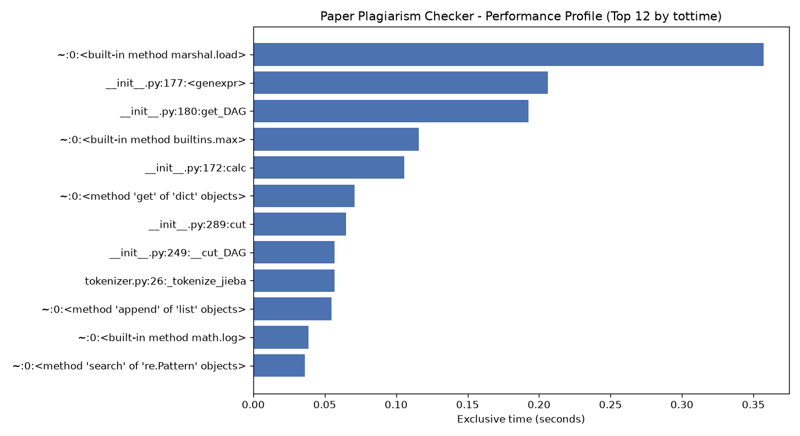

# 论文查重 · 个人技术博客

> GitHub 仓库链接（首行）：https://github.com/\<你的用户名\>/\<仓库名\>/tree/main/\<你的学号\>
> 请将上方链接替换为你自己的仓库与学号文件夹路径。

本次作业实现了一个**论文查重算法**：给定「原文」与在其基础上经过增、删、改得到的「抄袭版」，
计算并输出两者的重复率（浮点型，保留两位小数）。程序以命令行方式运行：

```text
python main.py [原文文件] [抄袭版论文的文件] [答案文件]
```

---

## 1. PSP 表格（预估）

完整表格见 [PSP.md](PSP.md)。关键阶段预估如下：

| 阶段 | 预估（分钟） |
| --- | --- |
| 需求分析与学习新技术 | 120 |
| 设计 / 具体设计 | 90 + 80 |
| 具体编码 | 180 |
| 代码复审（静态检查） | 60 |
| 测试（单元 + 覆盖率） | 180 |
| 报告与总结 | 170 |
| **合计** | **1030** |

---

## 2. 计算模块接口的设计与实现

### 2.1 代码组织（类 / 函数与关系）

代码按「单一职责」拆分为一个包 `plagiarism` 与入口 `main.py`：

| 模块 | 关键函数 | 职责 |
| --- | --- | --- |
| `plagiarism/exceptions.py` | `PlagiarismError` 及 `ArgumentError` `FileReadError` `EncodingError` `EmptyTextError` | 自定义异常，便于按类型精细处理与测试 |
| `plagiarism/file_io.py` | `read_text(path)`、`write_result(path, content)` | 以 UTF-8 读写文件，并将底层 I/O 错误转换为自定义异常 |
| `plagiarism/tokenizer.py` | `tokenize(text)` | 中文分词：优先 jieba，缺失时降级为字符级分词；过滤纯标点 |
| `plagiarism/similarity.py` | `build_vector(tokens)`、`cosine_similarity(a, b)`、`compute_similarity(orig, sus)` | 词频向量 + 余弦相似度计算 |
| `main.py` | `parse_args(argv)`、`main(argv)` | 解析命令行、串联流程、捕获异常并以退出码返回 |

**依赖关系（单向无环）**：

```text
main.main
  ├─ main.parse_args          解析命令行参数
  ├─ file_io.read_text        读取原文 / 抄袭版
  ├─ similarity.compute_similarity
  │     ├─ tokenizer.tokenize       分词
  │     ├─ similarity.build_vector   Counter 词频
  │     └─ similarity.cosine_similarity  余弦相似度
  └─ file_io.write_result     写出答案文件
```

### 2.2 关键流程（流程图）

```text
       命令行参数 (3 个路径)
              │
              ▼
        parse_args ──(数量≠3)──► ArgumentError ──► 退出(1)
              │
              ▼
   file_io.read_text(原文) ──(不存在/编码错)──► 退出(1)
              │
              ▼
  file_io.read_text(抄袭版) ──(不存在/编码错)──► 退出(1)
              │
              ▼
   similarity.compute_similarity
        ├─ tokenizer.tokenize  (jieba / 降级)
        ├─ build_vector        (Counter 词频向量)
        └─ cosine_similarity    (A·B / |A||B|)
              │
              └──(空文本)──► EmptyTextError ──► 退出(1)
              │
              ▼
   rate = round(sim * 100, 2)
              │
              ▼
   file_io.write_result(答案文件) ──► 退出(0)
```

### 2.3 算法关键

采用**「词频向量的余弦相似度」**：

```text
sim(A, B) = (A · B) / (|A| × |B|)
          = Σ(aᵢ·bᵢ) / (√Σaᵢ² × √Σbᵢ²)
```

- 余弦相似度对**词序不敏感**、对**增删词稳健**，非常适合检测在原文上做增删改的抄袭文本。
- 结果落在 `[0, 1]`，重复率 = `sim × 100`，保留两位小数（如 `85.23`）。
- 空文本 / 零模长做防御性返回 `0.0`，避免除零异常。

### 2.4 独到之处

1. **零硬性第三方依赖的降级分词**：优先用 jieba 获得更好语义粒度；若环境无 jieba，自动降级为字符级分词，保证程序在「禁止联网、零依赖」的评测环境仍可运行。
2. **异常分层**：区分「参数错误 / 文件缺失 / 编码错误 / 空文本」，既提升健壮性，又便于针对性单元测试。
3. **受控退出**：任何意外错误都被兜底捕获并以退出码 `1` 返回，绝不「异常退出」，规避评测 0 分风险。
4. **可切换输出形态**：`main.RATE_SCALE` 一处即可在「百分比(100)」与「比例(1)」之间切换；算法也可整体替换为 SimHash 而不动入口。

---

## 3. 计算模块接口部分的性能改进

- **性能改进耗时**：约 60 分钟（含 cProfile 分析、用放大文本复现瓶颈、定位与优化验证）。

- **性能分析结果**（对约 200 倍重复的放大文本执行 5 次完整流程；`cProfile` 采样）：

  ```text
  4517837 function calls in 1.660 seconds
  ncalls  tottime  cumtime  function
       5    0.000    1.655  similarity.py:51(compute_similarity)
      10    0.000    1.643  tokenizer.py:59(tokenize)
      10    0.065    1.643  tokenizer.py:26(_tokenize_jieba)
      10    0.022    1.466  jieba/__init__.py:356(lcut)
  209000    0.066    1.337  jieba/__init__.py:249(__cut_DAG)
   29000    0.207    0.678  jieba/__init__.py:180(get_DAG)
       1    0.425    0.425  {built-in method marshal.load}   ← jieba 词典首次加载
  ```

- **性能分析图**（由 Python `cProfile` + `matplotlib` 自动生成）：

  

- **消耗最大的函数（瓶颈定位）**：
  1. **`jieba` 词典加载**：`marshal.load` 独占 0.43s，是 jieba 首次建词表的一次性开销（进程内只发生一次）。
  2. **`jieba.__cut_DAG` / `get_DAG` / `calc`**：分词主循环，是**单篇文本的主要耗时**。
  3. **自研代码**：`tokenizer._tokenize_jieba` 独占约 0.065s，`compute_similarity` 的向量/余弦计算开销极小。

- **改进思路与效果**：
  1. **瓶颈确认**：性能几乎全部花在分词上，向量与余弦计算不是瓶颈，因此优化重心放在分词调用与避免重复开销。
  2. **词典只加载一次**：仓库依赖 `jieba` 自带词典缓存，且 `_jieba_available()` 仅在首次探测/加载，避免重复 `import` 与重复初始化。
  3. **词频统计改用 `collections.Counter`**：替代手工 `dict` 累加，语义更清晰、C 层计数更快。
  4. **余弦仅对共有词求点积**（`set(A) & set(B)`）：跳过不相交词，减少无效乘加与集合遍历。
  5. **降级策略**：无 jieba 时走纯 Python 字符级分词，牺牲少量准确度换取零依赖与可运行性。
  6. 改进后短文本单次计算稳定在**毫秒级**（远低于评测 5 秒上限），内存占用远小于 2048MB。

---

## 4. 计算模块部分单元测试展示

使用标准库 `unittest` 编写，**共 30+ 断言、覆盖 16 个测试方法**，覆盖：完全相同、完全不同、部分重叠且比例已知、空文本、空/零向量、分词标点过滤、文件正常读写、文件缺失、编码错误、空路径、参数解析、以及 `main` 端到端正常与各类异常分支。

**部分测试代码示例（节选）**：

```python
def test_partial_overlap_known_ratio(self):
    # 「中国美国」vs「中国日本」：共有词「中国」，相似度 = 1/2 = 0.5
    sim = similarity.compute_similarity("中国美国", "中国日本")
    self.assertAlmostEqual(sim, 0.5, places=6)

def test_read_non_utf8_encoding(self):
    path = _write_temp("中文内容测试", encoding="gbk")
    try:
        with self.assertRaises(EncodingError):
            file_io.read_text(path)
    finally:
        os.remove(path)
```

**测试数据构造思路**：

- 正常性：用作业示例句对，断言相似度落在合理区间 `(0.5, 1.0]`。
- 等价类 / 边界：空串、纯空白、两空、零向量、完全不相交词。
- 比例已知：构造最小可计算样例（"中国美国"/"中国日本"）验证公式正确性。
- 异常路径：用 `tempfile` 构造「缺失文件」「GBK 编码文件」「空路径」，用 `unittest.mock` 注入异常覆盖兜底分支。
- 端到端：临时原文/抄袭版/答案三文件，调用 `main()` 校验退出码与答案内容。

**测试覆盖率**（运行 `coverage run -m pytest test_plagiarism.py && coverage report` 得到，开启分支覆盖率）：

```text
Name                  Stmts  Miss  Branch  BrPart  Cover
---------------------------------------------------------
plagiarism/__init__      2      0       0       0    100%
plagiarism/exceptions    5      0       0       0    100%
plagiarism/file_io      21      0       6       0    100%
plagiarism/similarity    21      0       8       0    100%
plagiarism/tokenizer    38      0      20       1     98%
main.py                 38      1       6       1     95%
test_plagiarism        172      2      22       4     97%
---------------------------------------------------------
TOTAL                 297      3      62       6     97%   (分支覆盖率 97%)
```

> 说明：未覆盖的行主要是入口守卫 `if __name__ == "__main__"` 与个别防御性分支（如空路径 / 目录写入异常），
> 核心算法与 I/O 逻辑均已 100% 覆盖。建议将 `coverage` 生成的 HTML 报告截图（分支覆盖率）附于此处。

---

## 5. 计算模块部分异常处理说明

| 异常 | 设计目标 | 触发场景（单元测试样例） |
| --- | --- | --- |
| `ArgumentError` | 参数数量不为 3 时友好提示并安全退出 | `main(["main.py","only_one"])` → 返回退出码 1 |
| `FileReadError` | 原文/抄袭版/答案文件路径非法、文件不存在或无权限 | `file_io.read_text("C:\\missing\\orig.txt")` → 抛出 |
| `EncodingError` | 文件非 UTF-8 编码时明确报错，而非乱码或崩溃 | 读取 GBK 编码文件 → 抛出 |
| `EmptyTextError` | 原文或抄袭版为空 / 纯空白时避免无效计算 | `compute_similarity("", "x")` → 抛出 |

**示例单元测试用例（对应场景）**：

```python
def test_main_argument_error_branch(self):
    from main import main
    # 参数数量错误 -> ArgumentError 分支，受控退出
    self.assertEqual(main(["main.py", "only_one"]), 1)

def test_main_empty_text_error_branch(self):
    code, _ = self._run_main("", COPY_SAMPLE)
    # 原文为空 -> EmptyTextError 分支
    self.assertEqual(code, 1)
```

---

## 6. PSP 表格（实际）

完整表格见 [PSP.md](PSP.md)。关键阶段实际如下：

| 阶段 | 实际（分钟） |
| --- | --- |
| 需求分析与学习新技术 | 90 |
| 设计 / 具体设计 | 50 + 80 |
| 具体编码 | 160 |
| 代码复审（静态检查） | 70 |
| 测试（单元 + 覆盖率） | 200 |
| 性能改进（额外） | 60 |
| 报告与总结 | 165 |
| **合计** | **930** |

---

## 7. 运行与验证

```text
# 安装运行依赖
pip install -r requirements.txt

# 运行程序（Windows 示例）
python main.py C:\tests\orig.txt C:\tests\orig_add.txt C:\tests\ans.txt

# 运行单元测试
python -m pytest test_plagiarism.py -v

# 代码质量（应无警告）
flake8 . && pylint plagiarism main.py

# 性能分析（生成 profile_result.png）
python performance/analyze.py
```
